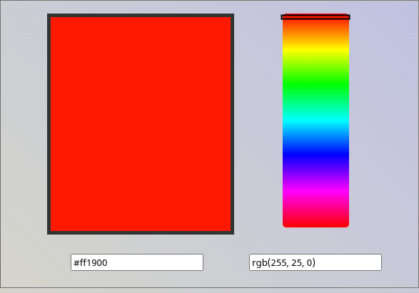

# Code Labs Academy - Color Picker

### the simplest color picker made in html, css and javascript
---

## Introduction

This is one of the coding challenges for **Unit 1 : Basics** of the __web development bootcamp__ offered by [Code Labs Academy](https://codelabsacademy.com), in this unit we go through basic languages that are crucial for web development. We learn the major concepts of HTML, CSS and JavaScript while providing challenges and homeworks for an optimal hands-on learning experience.

## Challenge description

In this project, we will get more familiar with the concept of DOM manipulation using Javascript. We will be moving elements inside other elements and apply mathematical functions to know the right color to set to an element.

Here is how the end result should look like :

In this web site, we have a **color bar** containing all the possible color combinations of RGB (red, green and blue), and a **handle** that we will have to move to point to the correct color we want to use. Also, we have a **square** that projects the result or the selected color and two inputs that contain the HEX and RGB presentation of that color.

Here are the steps to follow to complete this project:

* First, when clicking on the color bar, move the handle to that position in the color bar.
* Figure out a way to select the color present inside the handle.
* present that color in the square using css, and in the two inputs using text value.

> ## Hints and guidance
> Trying to do this project on your own will help you develop yourself in a huge way as you will learn many new concepts and discover helpful packages.
> 
> But to make this experience a bit easier on beginners just starting web development, and make it less time consuming, we included a milestone with a list of issues that will walk you through the process of building this project and give you hints and pieces of code to make your life easier.

Feel free to do this project on your own, or take a glance at the provided hints.

**Happy coding!** 😄